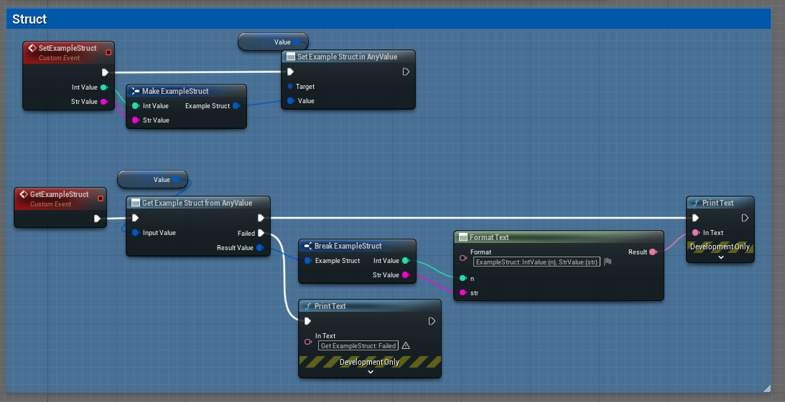
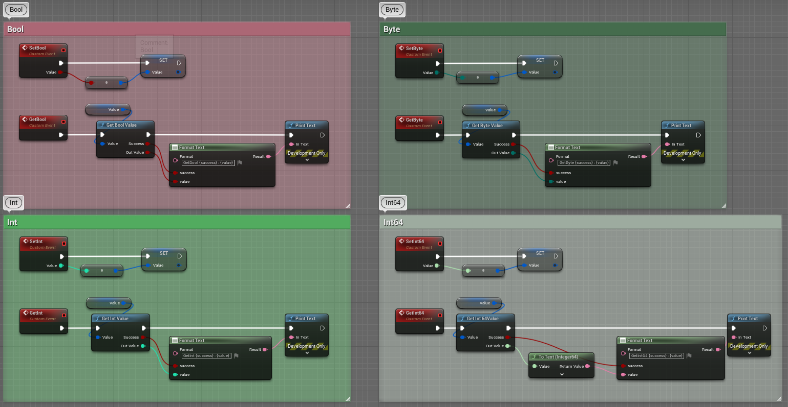

# AnyValue Plugin


## UE4 Marketplace

URL

# 概要

`FAnyValue` はC++の `std::any` のように様々な型を保持・取得できる型です。

各種Primitive型・文字列型・構造体・UObject等に対応しています。


# Blueprintでの使い方

## 構造体の設定・取得



## Primitive型・文字列型の設定・取得




## Object関連型の設定・取得


# C++での使い方

使用するモジュールのBuild.csファイルに `AnyValue` モジュールへの依存を追加します。

```cs
public class AnyValueExample : ModuleRules
{
	public AnyValueExample(ReadOnlyTargetRules Target) : base(Target)
	{
		PCHUsage = PCHUsageMode.UseExplicitOrSharedPCHs;
	
		PublicDependencyModuleNames.AddRange(new string[] {
			"Core",
			"CoreUObject",
			"Engine",
			"InputCore",
			"AnyValue",		// 依存モジュールを追加.
		});

		PrivateDependencyModuleNames.AddRange(new string[] {  });
	}
}
```

ヘッダのインクルードを追加します。

```cpp
#include "AnyValue/AnyValue.h"
```

## 値の設定

### Primitive型・文字列型・構造体の設定

FAnyValueに値を代入することで値を設定できます。

```cpp
    FAnyValue AnyValue;

    // assign int32
    AnyValue = 42;

    // assign FString
    FString Str = TEXT("str");
    AnyValue = Str;
    
    // assign USTRUCT
    FAnyValueExampleStruct Struct;
    Struct.IntValue = 42;
    Struct.StringValue = TEXT("str");
    AnyValue = Struct;
```

型を明示した初期化方法として `FAnyValue::Create` 関数が用意されています。

```cpp
    // create int32
    AnyValue = FAnyValue::Create<int32>(42);

    // create FString
    AnyValue = FAnyValue::Create<FString>(TEXT("str"));
    
    // create USTRUCT
    AnyValue = FAnyValue::Create<FAnyValueExampleStruct>();
```

`Set` 関数は設定された値の参照を返します。
戻り値から値の設定や関数の呼び出しをしたい場合に利用できます。

```cpp
    // set USTRUCT
    FAnyValueExampleStruct& NewStruct = AnyValue.Set<FAnyValueExampleStruct>();
    NewStruct.IntValue = 42;
```

### Primitive型・文字列型・構造体の取得

値の取得には `As` 関数が利用できます。
`As` 関数は指定した型を取得できない場合、nullptrを返します。

```cpp
    // get int32
    if (const int32* Value = AnyValue.As<int32>())
    {
        UE_LOG(LogTemp, Log, TEXT("int32: %d"), *Value);
    }

    // get FString
    if (const FString* Value = AnyValue.As<FString>())
    {
        UE_LOG(LogTemp, Log, TEXT("FString: %s"), **Value);
    }

    // get USTRUCT
    if (const auto* Value = AnyValue.As<FAnyValueExampleStruct>())
    {
        UE_LOG(LogTemp, Log, TEXT("FAnyValueExampleStruct: %d, '%s'"), Value->IntValue, *Value->StringValue);
    }
```

### UObject関連型の設定

`UScriptStruct*` コンストラクタとの混同を避けるため、 UObject関連の型では通常のコンストラクタでの初期化・代入ができないようになっています。

以下の専用の初期化関数を利用してください。

```cpp
    // set UObject
    AnyValue = FAnyValue::FromObject(this);
    AnyValue = FAnyValue::FromSoftObjectPtr(this);
    AnyValue = FAnyValue::FromClass(GetClass());
    AnyValue = FAnyValue::FromSoftClassPtr(GetClass());
```

### UObject関連型の取得

UObject関連の型も`As<UObject*>()` のように呼び出すことで他の型と同様に取得することができます。

戻り値の方は `UObject**` となってしまうためオブジェクトの利用に2段階のチェックが必要になります。

```cpp
	// get UObject
    if (UObject*const* ObjectValuePtr = AnyValue.As<UObject*>())
    {
        if(AAnyValueExamples* ObjectValue = Cast<AAnyValueExamples>(*ObjectValuePtr))
        {
            UE_LOG(LogTemp, Log, TEXT("AAnyValueExamples: '%s'"), *ObjectValue->GetName());
        }
    }
```

そのためUObject関連の型では以下のような専用の取得関数が用意されています。

```cpp
    // get UObject
    if (AAnyValueExamples* ObjectValue = AnyValue.GetObjectValue<AAnyValueExamples>())
    {
        UE_LOG(LogTemp, Log, TEXT("AAnyValueExamples: '%s'"), *ObjectValue->GetName());
    }
    if (TSoftObjectPtr<UObject> ObjectValue = AnyValue.GetSoftObjectPtrValue())
    {
        UE_LOG(LogTemp, Log, TEXT("TSoftObjectPtr<UObject>: '%s'"), *ObjectValue.ToString());
    }
    if (TSubclassOf<AAnyValueExamples> ClassValue = AnyValue.GetClassValue<AAnyValueExamples>())
    {
        UE_LOG(LogTemp, Log, TEXT("TSubclassOf<AAnyValueExamples>: '%s'"), *ClassValue->GetName());
    }
    if (TSoftClassPtr<UObject> ClassValue = AnyValue.GetSoftClassPtrValue())
    {
        UE_LOG(LogTemp, Log, TEXT("TSoftClassPtr<UObject>: '%s'"), *ClassValue.ToString());
    }
```

